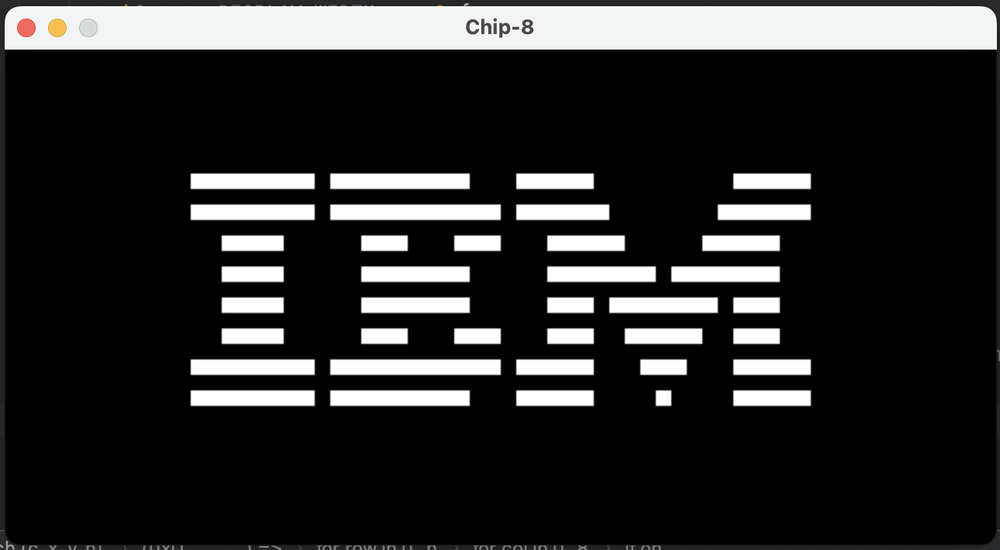
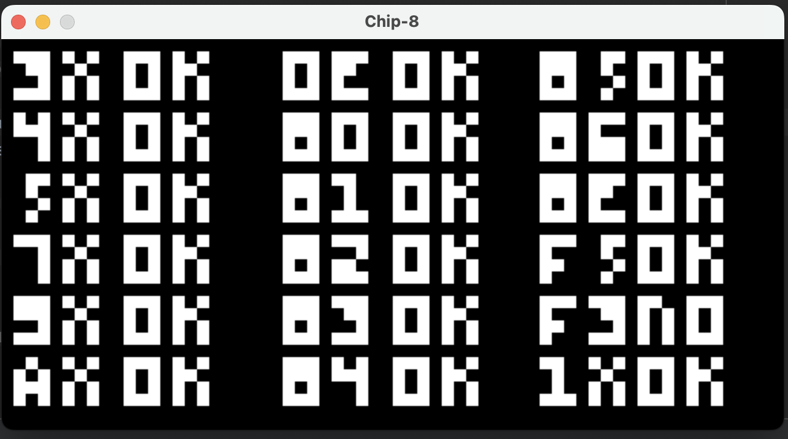
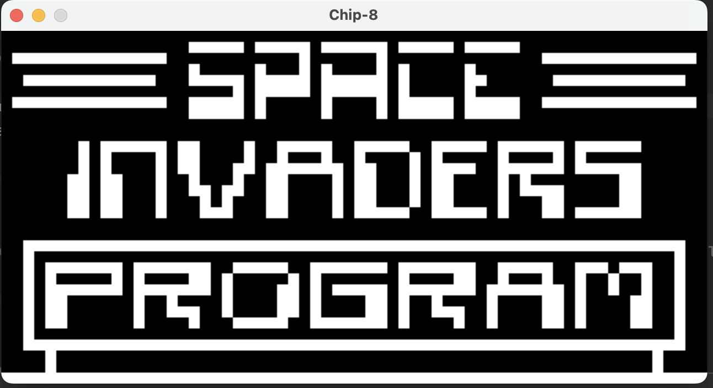
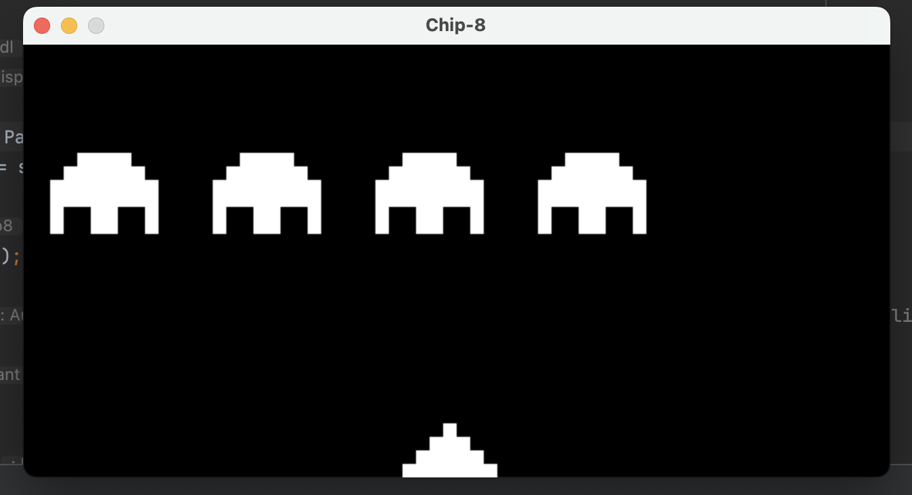
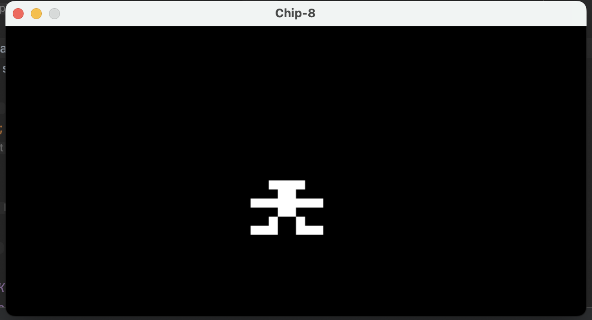

# Chip-8 Interpreter

A fully functional Chip-8 interpreter written in Rust, demonstrating deep understanding of emulation, low-level systems programming, and graphics rendering.

> This project is an **interpreter**, not an emulator—a key distinction showing understanding of the differences between these concepts.

## Key Achievements

- **Accurate CPU Emulation**: Implemented all 35 Chip-8 opcodes with precise instruction decoding and execution logic
- **Memory Management**: Designed and implemented a complete memory model (4KB RAM, stack, and registers) with proper address mapping
- **Graphics Rendering**: Integrated SDL2 for pixel-perfect display rendering at configurable scales
- **Input Handling**: Built a complete input system mapping hexadecimal keypad to AZERTY keyboard layouts
- **ROM Compatibility**: Successfully runs multiple ROM files including IBM logo, test suites, and games (Space Invaders, Pong variants)

## Technical Learning Outcomes

Through this project, I deepened my knowledge in:

- **Low-level systems programming**: Understanding CPU instruction cycles, memory layout, and register operations
- **Rust systems programming**: Leveraging Rust's safety guarantees while working with raw memory and hardware-level abstractions
- **Emulation architecture**: Learning how interpreters decode and execute instructions, manage state, and handle timing
- **SDL2 integration**: Graphics programming and real-time input handling in Rust

## Project Demo

### IBM Logo ROM

<div align="center">
    
</div>

### Test ROM - All Digits Passing

<div align="center">
    
</div>

### Space Invaders Gameplay

<div align="center">
    
</div>

<div align="center">
    
</div>

### Simple Video Game

<div align="center">
    
</div>

## Requirements

- **SDL2**: Graphics and input library. Must be installed else program will not compile.
- **Rust**: 1.56 or later

## Usage

Clone the repository and navigate to the project directory:

```bash
git clone https://github.com/morukele/Chip-8
cd Chip-8
```

### Running the Interpreter

```bash
cargo run -- -r ROM-NAME
```

This runs the interpreter with default settings and loads the specified CHIP-8 ROM file.

### Command-line Options

- `-r`, `--rom`: Name of CHIP-8 ROM file (include file extension) [default: `1-chip8-logo`]
- `-s`, `--scale`: Display scale factor [default: `10`]
- `-h`, `--help`: Print help information
- `-V`, `--version`: Print version information

#### Example with Custom Settings

```bash
cargo run -- -r space_invaders.ch8 -s 15
```

## AZERTY Keyboard Mapping

The Chip-8 was originally designed for AZERTY keyboards. This interpreter maps the 16-key hexadecimal keypad as follows:

| Chip-8 Key | AZERTY Key |
| ---------- | ---------- |
| `1`        | `&`        |
| `2`        | `é`        |
| `3`        | `"`        |
| `C`        | `'`        |
| `4`        | `a`        |
| `5`        | `z`        |
| `6`        | `e`        |
| `D`        | `r`        |
| `7`        | `q`        |
| `8`        | `s`        |
| `9`        | `d`        |
| `E`        | `f`        |
| `A`        | `w`        |
| `0`        | `x`        |
| `B`        | `c`        |
| `F`        | `v`        |

## Resources

- [Write a Chip-8 Emulator](https://tobiasvl.github.io/blog/write-a-chip-8-emulator/)
- [Chip-8 Technical Reference](http://devernay.free.fr/hacks/chip8/C8TECH10.HTM)
