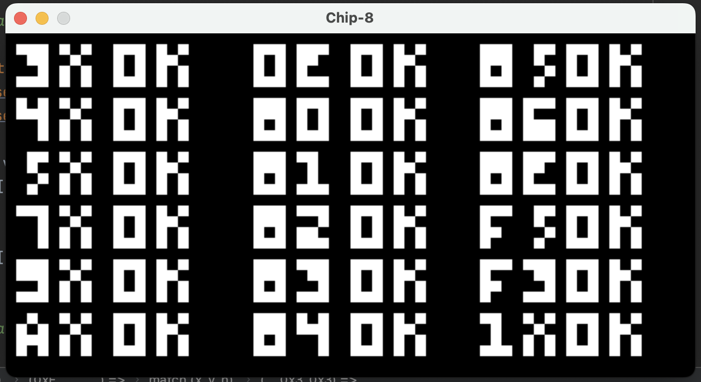

# Chip-8
An implementation of the Chip-8 emulator written in Rust.
> Technically, it is an interpreter and not an emulator.

### Images

The famous IBM rom on full display.
<div align="center">
    
</div>

Test rom for digits all passing
<div align="center">
    
</div>

A simple video game rom
<div align="center">
    
</div>

Space Invader ROM
<div align="center">
    
</div>

Space Invader ROM Gameplay
<div align="center">
    
</div>

### Usage
Pull the repo, cd into the directory on your CLI.
``` bash
  git pull https://github.com/morukele/Chip-8
  cd file/path/to/chip-8
```

To run the CHIP-8 emulator, use the command-line interface. Below are examples of how to use the emulator with various options.

#### Basic command
```bash
cargo run -- -r ROM-NAME
```
This runs the emulator with default settings and loads the specified CHIP-8 ROM file.

#### Options
Here are the options available
- `-r`, `--rom` Name of CHIP-8 ROM file (remember to specify the extension) [default: 1-chip8-logo]
- `-s` Set the scale of the display [default: 10]
- `-h`, `--help`       Print help
- `-V`, `--version`    Print version

```bash
cargo run -- -r ROM-NAME -s 10
```
This runs the emulator with the specified ROM file and the specified scale factor of 1O

###  AZERTY Keyboard Layout for CHIP-8
> The CHIP-8 was designed for AZERTY keyboards.

The CHIP-8 has a hexadecimal keypad with 16 keys (0x0 to 0xF). This layout is mapped to an AZERTY keyboard as follows:

| CHIP-8 Key | AZERTY Key |
|------------|------------|
| `1`        | `&`        |
| `2`        | `é`        |
| `3`        | `"`        |
| `C`        | `'`        |
| `4`        | `a`        |
| `5`        | `z`        |
| `6`        | `e`        |
| `D`        | `r`        |
| `7`        | `q`        |
| `8`        | `s`        |
| `9`        | `d`        |
| `E`        | `f`        |
| `A`        | `w`        |
| `0`        | `x`        |
| `B`        | `c`        |
| `F`        | `v`        |

####  Notes
- **Key Mapping**:
    - CHIP-8 keys are mapped to the AZERTY keyboard as closely as possible.
    - The keys are chosen to approximate a physical arrangement similar to the CHIP-8 keypad.

- **Adjustments for AZERTY Layout**:
    - The keys `&`, `é`, `"`, and `'` are used for the top row because they correspond to `1`, `2`, `3`, and `C` in hexadecimal.
    - Standard letters (`A`, `Z`, `E`, `R`, etc.) are used for the middle rows.

- **Usage**:
    - This mapping allows you to easily interact with the emulator using an AZERTY keyboard.
    - Make sure to press the appropriate AZERTY key to correspond to the CHIP-8 keypad.

## Resources
- https://tobiasvl.github.io/blog/write-a-chip-8-emulator/
- http://devernay.free.fr/hacks/chip8/C8TECH10.HTM